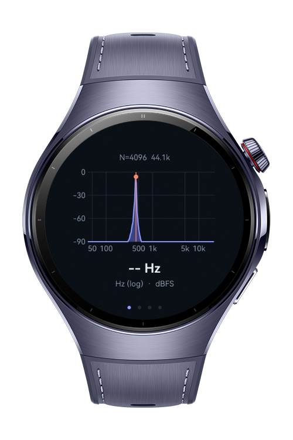
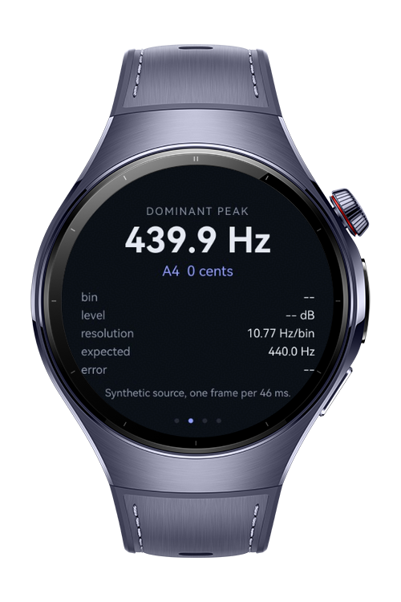
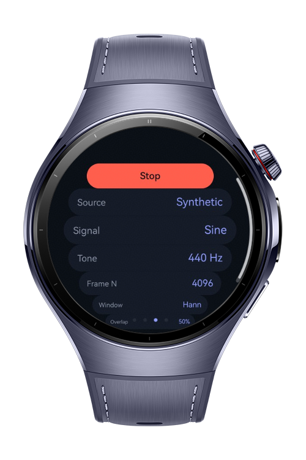
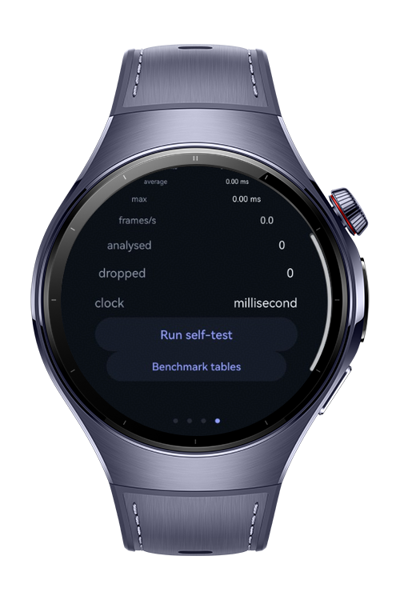

> **Note:** To access all shared projects, get information about environment setup, and view other guides, please visit [Explore-In-HMOS-Wearable Index](https://github.com/Explore-In-HMOS-Wearable/hmos-index).

# How To Implement FFT

**How To Implement FFT** is a HarmonyOS wearable codelab that implements a Cooley-Tukey
radix-2 Fast Fourier Transform **in pure ArkTS with zero dependencies**, and applies it to
live audio frames on a watch.

# Preview

<div>    
  
  
  
  
</div> 

The headline constraint is the point of the whole project:

> `entry/src/main/ets/dsp/` imports nothing outside itself. No `@kit.*`, no `@ohos.*`, no
> ArkUI. Only ArkTS built-ins — `Math`, `Float64Array`, `Uint16Array`. Copy that folder
> into any ArkTS project and it works unchanged.

`oh-package.json5` has an empty dependency list, and it stays that way.

`What You'll Learn`

- Write an iterative, in-place, decimation-in-time radix-2 FFT, and understand the
  butterfly it is built from.
- Precompute bit-reversal and twiddle-factor tables, and measure what that buys you — the
  app benchmarks the table-driven transform against a naive one that calls `Math.cos`
  inside the inner loop.
- Turn `AudioCapturer`'s arbitrarily-sized buffers into exactly 4096 samples, with
  configurable overlap and zero allocation in the steady-state path.
- Scale a magnitude spectrum so the numbers mean something: amplitude-correct dBFS that
  reads the same under any window and at any N.
- Recover a peak frequency far more precisely than the bin spacing suggests, using
  parabolic interpolation.
- Decide between the UI thread and `@ohos.taskpool` by measuring rather than guessing —
  and work around the ArkTS rule that stops a `@Concurrent` function keeping its tables warm.
- Prove the implementation is correct with eight numerical checks, including a comparison
  against a direct O(N²) DFT.
- Lay out a wearable UI for a **round** display using `Swiper` + `ArcList`.

# Use Cases

- **See a signal's frequency content**, live, on a watch — 2049 bins at N = 4096, on a
  log-frequency axis so every octave gets equal width.
- **Verify a DSP implementation on-device**, by running the self-test from the Diagnostics
  page and reading the measured error of each check.
- **Compare analysis windows** by switching between Rectangular, Hann, Hamming and
  Blackman while a tone plays, and watching spectral leakage tighten or spread.
- **Find a dominant frequency more precisely than the bin grid allows** — at 44.1 kHz and
  N = 4096 the bins are 10.77 Hz apart, and interpolation recovers the peak to a fraction
  of a hertz.
- **Choose a threading strategy from measurements** taken on the actual target hardware,
  rather than from an assumption about what a watch CPU can do in 46 ms.
- **Analyse audio without a microphone**, using the built-in synthetic generator — which
  also means you always know what the right answer looks like.

# Technology

## Stack

- **Languages**: ArkTS, ArkUI
- **Frameworks**: HarmonyOS SDK 6.0.1(21)
- **Tools**: DevEco Studio 6.0
- **Libraries**:
  - **None for the FFT itself.** `dsp/` is dependency-free by design.
  - `@kit.AudioKit` (`audio.AudioCapturer`) — live PCM capture.
  - `@kit.ArkTS` (`taskpool`) — off-main-thread transforms.
  - `@kit.ArkUI` (`ArcList`, `ArcListItem`, `Swiper`, `Canvas`) — round-screen layout and plotting.
  - `@kit.AbilityKit` (`abilityAccessCtrl`) — runtime microphone permission.
  - `@kit.BasicServicesKit` (`systemDateTime`) — nanosecond monotonic clock for benchmarking.
  - `@ohos/hypium` — unit tests.

## Required Permissions

- `ohos.permission.MICROPHONE` — only for the live source. The app launches on the
  synthetic source and needs no permission to be fully functional.

# Directory Structure

```text
entry/src/main/ets/
├── entryability/
│   └── EntryAbility.ets
├── entrybackupability/
│   └── EntryBackupAbility.ets
│
├── dsp/                          # ← ZERO EXTERNAL IMPORTS. Copy-paste portable.
│   ├── Fft.ets                   # radix-2 DIT + bit-rev/twiddle tables; also NaiveFft, the benchmark baseline
│   ├── Window.ets                # Rect / Hann / Hamming / Blackman + coherent gain
│   ├── Spectrum.ets              # magnitude, amplitude-correct dBFS, peak + parabolic interpolation
│   └── FftSelfTest.ets           # eight numerical checks, runnable on-device
│
├── audio/
│   ├── FrameAssembler.ets        # ragged PCM chunks → fixed-N frames with hop/overlap
│   ├── SignalGenerator.ets       # sine / two-tone / harmonics / chirp / noise
│   └── MicSource.ets             # AudioCapturer with sample-rate negotiation
│
├── engine/
│   ├── FftEngine.ets             # frame → window → FFT → spectrum
│   ├── FftTask.ets               # @Concurrent taskpool entry point
│   ├── FftWorkerCache.ets        # keeps a worker's twiddle tables warm (see Implementation Notes)
│   └── AnalyzerController.ets    # source wiring, timing, statistics
│
├── common/
│   ├── types.ets                 # SourceKind, SignalKind, EngineMode, FftConfig, EngineStats
│   ├── Format.ets                # Hz / dB / ms formatting, frequency → note name
│   ├── Clock.ets                 # nanosecond monotonic clock
│   ├── Theme.ets                 # palette, type scale, round-screen safe area
│   └── SpectrumStore.ets         # the latest frame, held where the UI can read it
│
├── components/
│   ├── SpectrumCanvas.ets        # log-frequency dBFS plot
│   ├── PeakReadout.ets           # frequency, bin, level, note, measured error
│   ├── ControlsPanel.ets         # ArcList of tap-to-cycle settings
│   └── DiagnosticsPanel.ets      # timings, self-test runner, twiddle-table benchmark
│
└── pages/
    └── Index.ets                 # Swiper hosting the four pages

entry/src/test/
└── FftTest.ets                   # 16 hypium unit tests
```

# Implementation Notes

## The transform

Iterative in-place radix-2 DIT, with real and imaginary parts in two separate
`Float64Array`s rather than one interleaved array — the butterfly reads like the textbook
version instead of drowning in `*2` / `+1` index arithmetic.

Everything expensive is built once in the constructor: a `Uint16Array` bit-reversal table
and two `Float64Array` twiddle tables of `N/2` entries each (40 KB total at N = 4096).
Nothing is allocated in the analysis path after that.

The inverse transform is the same code with the sign of the twiddle's imaginary part
flipped, plus a `1/N` scale — three lines, and it buys the round-trip correctness test.

## Why precompute the twiddles

A naive implementation calls `Math.cos`/`Math.sin` inside the butterfly: **24,576
transcendental calls per 4096-point frame**. `NaiveFft` in `dsp/Fft.ets` exists solely so
the difference can be measured rather than asserted. On desktop Node 18 the table-driven
version runs a 4096-point frame in **0.081 ms** against the naive version's **0.527 ms** —
**6.5× faster**. Press *Benchmark tables* on the Diagnostics page for the figure on your
own hardware; a watch CPU will be considerably slower than a laptop, and the ratio is what
matters.

## Bins are not frequencies

At 44.1 kHz with N = 4096, bin spacing is **10.766 Hz** — close to a semitone at guitar
pitch. Reporting the peak bin's centre frequency is therefore not good enough for anything
pitch-related.

`Spectrum.findPeak` fits a parabola through the dB values of the peak bin and its two
neighbours and takes the vertex. Measured on a tone deliberately placed 0.37 bins off
centre at N = 4096:

| | Error |
|---|---|
| Raw peak bin | 3.98 Hz |
| Parabolic interpolation | **0.15 Hz** |

The Readout page shows the raw bin, the sub-bin offset, and — on the synthetic source —
the measured error against the frequency the generator was asked for, so the claim is
checkable on screen.

## Scaling that means something

A bar chart of raw `|X[k]|` is a picture, not a measurement. For a windowed real sine of
amplitude `A` on a bin centre, `|X[k]| = A · N · CG / 2`, where `CG` is the window's
coherent gain. Dividing it back out gives dBFS where a full-scale sine reads 0 dB — at any
N, under any window. A unit test asserts a 0.25-amplitude sine reads **−12.0412 dBFS**
under all four windows.

## The `@Concurrent` restriction

This one cost a build failure and is worth knowing before you hit it:

```
10705000 Syntax Error: Concurrent function should only use import variable or
local variable, 'cachedEngine' is not one of them
```

A `@Concurrent` function may reference **imported** variables and **local** variables —
but a plain module-level `let` in its own file is neither. That matters here because
rebuilding the engine locally on every call means recomputing 2048 cosines and 2048 sines
per frame, which is roughly the cost of the transform itself and would make TaskPool look
far worse than it is for reasons unrelated to threading.

`engine/FftWorkerCache.ets` exists solely to solve this: the cache lives in its own module
and is reached through an import binding, which the rule permits. Each taskpool worker
loads its own instance, so it is per-worker state — no locking, nothing crossing a thread
boundary.

## Main thread or TaskPool

Both are implemented and switchable at runtime, with a live millisecond readout, because
the answer genuinely depends on hardware and N. TaskPool avoids blocking the UI thread but
pays for dispatch, a copy into a transferable buffer, a copy back out, and a cold worker
on the first frame. At small N that overhead can exceed the transform — TaskPool being
*slower* is a real result, not a bug.

The TaskPool path **drops** frames when the worker is busy rather than queueing them.
Queueing would grow an unbounded backlog and leave the display lagging further behind live
audio; dropping keeps the spectrum current and surfaces overload as a visible
dropped-frame count.

Frame timings are measured with `systemDateTime.getUptime(ACTIVE, true)` — nanoseconds.
`Date.now()` resolves to 1 ms, which would report every measurement as 0, 1 or 2.

## Frames from ragged buffers

`AudioCapturer`'s `readData` delivers buffers sized by the audio HAL — not a power of two,
not necessarily constant between calls. `FrameAssembler` is a circular buffer of exactly
one frame that emits fixed `N`-sample frames at a configurable hop, converts S16LE to
`[-1, 1)`, and allocates nothing after construction. (Dividing by 32768 rather than 32767
maps the asymmetric int16 range without clipping −32768.)

Default hop is `N/2` — 50% overlap. At 44.1 kHz and N = 4096 that is 21.5 frames/s and a
~46 ms budget per frame.

## Synthetic first, microphone second

The app launches on the synthetic generator, and that is a design decision rather than a
fallback. You know the answer before you look, it works on the simulator where there is no
microphone, and no permission dialog stands between opening the app and seeing a spectrum.
The Readout page shows the expected peak next to the measured one.

The microphone path negotiates its sample rate — 44.1 kHz first, 16 kHz fallback — and
reads back what it actually got, because every bin-to-hertz conversion depends on it.

## Round-screen layout

A circular display clips on distance from the centre in **both** axes, so a vertical split
pushes content toward the poles where the bezel cuts it into slivers. Four full-bleed
`Swiper` pages avoid that; list-shaped content uses `ArcList`/`ArcListItem`, which insets
each row by its distance from the pole. The largest square that fits inside a circle is
`d/√2` ≈ 70% of the diameter — `SAFE_SQUARE` in `common/Theme.ets` uses 76%.

The spectrum is drawn on a `Canvas` rather than a component tree: 2049 bins arriving ~21
times a second through ArkUI's diffing would spend more time in layout than in the FFT it
displays. Bins are reduced to one value per pixel column by taking the **maximum**, not
the average — a narrow peak sharing a column with forty other bins would otherwise be
averaged into invisibility, and that peak is the whole point.

## Two more ArkTS gotchas

- **Don't name a component callback `onSizeChange`.** `CustomComponent` already declares
  it as a layout callback, and the clash fails the build with a confusing error about
  `SizeChangeCallback`. Renamed to `onFrameSizeChange`.
- **`Int16Array.buffer` is typed `ArrayBufferLike`**, and passing it to a parameter
  declared `ArrayBuffer` trips `arkts-no-structural-typing`. Construct the view over an
  explicit `ArrayBuffer` and pass that.

## Correctness

A hand-written FFT with a subtle index bug still produces output that *looks* like a
spectrum, so correctness is tested rather than eyeballed. Eight checks live in
`dsp/FftSelfTest.ets`, runnable on-device from the Diagnostics page and also run as unit
tests:

| Check | Asserts |
|---|---|
| DC input | All energy in bin 0 |
| Impulse at n=0 | Flat magnitude across all bins |
| Sine on a bin centre | Correct bin, amplitude recovered to 1e−9 |
| Sine between bins | Interpolated frequency within 0.5%, and better than the raw bin |
| Linearity | `FFT(a·x + b·y) == a·FFT(x) + b·FFT(y)` |
| Parseval's theorem | Time-domain energy equals frequency-domain energy |
| Forward → inverse | Round-trip error < 1e−10 |
| **Matches direct DFT (N=64)** | Agrees with an O(N²) DFT computed from the definition |

The last one is the important one: it depends on none of the machinery under test, so a
wrong bit-reversal table or twiddle stride has nowhere to hide.

`entry/src/test/FftTest.ets` runs all eight at **every** supported frame size (256 through
4096) plus guard, window, scaling and `FrameAssembler` tests.

**Current status: 16 tests, 16 pass, 0 failures**, executed on the ArkTS runtime via
`hvigor test`.

# Constraints and Restrictions

## Supported Device

- Huawei Watch (HarmonyOS wearable, round display, 466×466)
- DevEco Studio Simulator — fully functional on the synthetic source

## Known Limitations

- **No signing configuration**, so the app is verified to compile (`assembleHap` produces
  a 433 KB unsigned HAP) and the unit tests pass, but it has **not been deployed to a
  device or emulator**. Nothing here has been seen on a physical watch screen.
- **On-device performance numbers are unmeasured.** The 6.5× twiddle-table speedup quoted
  above is from desktop Node 18. The Diagnostics page exists so you can take the real
  figures on your own hardware.
- **Radix-2 only**, so frame sizes must be powers of two. Non-power-of-two lengths would
  need Bluestein's algorithm, which is out of scope.
- **No real-input FFT optimization.** Packing N real samples into an N/2 complex transform
  is roughly 2× faster and halves memory, but it obscures the butterfly this codelab
  exists to teach. It is the first thing to reach for if you need more headroom.
- **Mono only.** `FrameAssembler` assumes a single channel; multi-channel input would need
  deinterleaving or downmixing first.

# License

**How To Implement FFT** is distributed under the terms of the MIT License. See the [LICENSE](LICENSE) for more information
